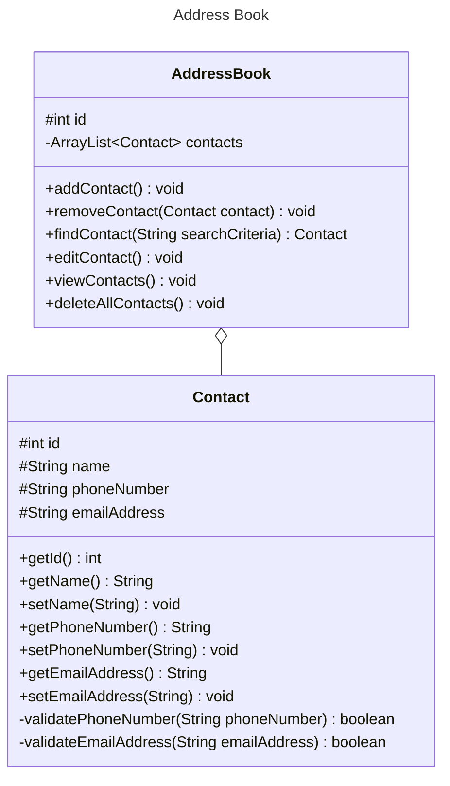

# Domain Models, Class Diagrams and Test Plan

## User Stories
As a user, I want to have an address book to store all my contacts in.

As a user, I want to be able to add a contact's details to my address book.

As a user, I want to be able to remove a contact from my address book.

As a user, I want to be able to search for a contact by their name and see their entry.

As a user, I want to be able to edit a contact's details, in case they change their phone number or email.

As a user I don't want duplicate phone numbers or emails in a contact's entry

As a user, I want to be able to see all the contacts I've stored in the address book.

### Additional Requirement Stories

As a user, I want to be able to search for a contact by their phone number and see their entry.

As a user, I want to be able to search for a contact by their email address and see their entry.

As a user, I want to be able to search for a contact by either name, phone number or email address, and have the results displayed alphabetically.

As a user, I want to be able to delete all of my contacts at once.

## Class Diagram

