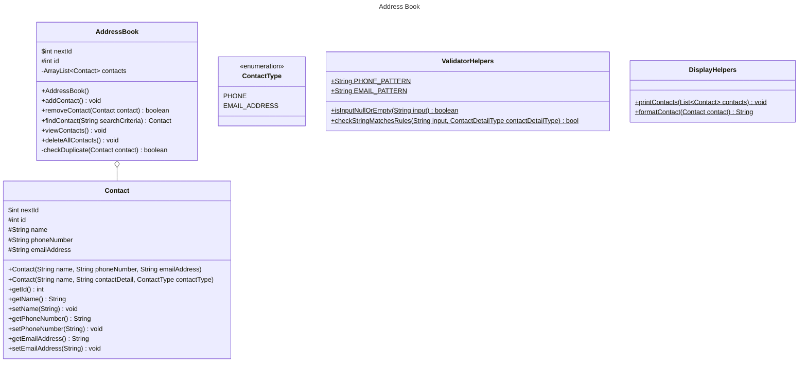

# Domain Models, Class Diagrams and Test Plan

## User Stories
As a user, I want to have an address book to store all my contacts in.

As a user, I want to be able to add a contact's details to my address book.

As a user, I want to be able to remove a contact from my address book.

As a user, I want to be able to search for a contact by their name and see their entry.

As a user, I want to be able to edit a contact's details, in case they change their phone number or email.

As a user I don't want duplicate phone numbers or emails in a contact's entry

As a user, I want to be able to see all the contacts I've stored in the address book.

### Additional Requirement Stories

As a user, I want to be able to search for a contact by their phone number and see their entry.

As a user, I want to be able to search for a contact by their email address and see their entry.

As a user, I want to be able to search for a contact by either name, phone number or email address, and have the results displayed alphabetically.

As a user, I want to be able to delete all of my contacts at once.

## Class Diagram

## Test Plan

### AddressBook Tests

#### addContact
* Length of ArrayList<> contacts should increase by 1
* Adding a null Contact should throw an exception
* Should not be able to add a contact with a duplicate phone number or email

#### checkDuplicate
+ Will be tested in it's calling class, addContact
+ Should return true if the parameter is a duplicate of an existing Contact's phone number
+ Should return true if the parameter is a duplicate of an existing Contact's email
+ Should return false if the argument is not a duplicate of any data

#### removeContact
+ Length of ArrayList<> contacts should decrease by 1
+ removeContact will return true if successfully removed a Contact
+ Contact cannot be found in ArrayList<> contacts after calling this function
+ Trying to remove a Contact that isn't in already in the list will not affect the contacts list and will return false
+ Trying to remove a null contact should throw an exception
+ Trying to remove a contact when the list is empty should return false

#### findContact
+ Should return the first Contact that matches search criteria
+ Function should return a null if it cannot find the Contact
+ Should throw an error if a null object is passed to it

#### viewContacts
+ Should call a print statement for each element in the contacts list

#### deleteAllContacts
+ The contacts list should be empty after this function runs

### Contact Tests

#### Constructor(String name, String contactDetail, ContactType contactType)
+ If contactType is PHONE, should correctly set the phone number for this contact, not the email address
+ If contactType is EMAIL_ADDRESS, should correctly set the email address for this contact, not the email address

[//]: # (#### validatePhoneNumber)

[//]: # (+ As it's a private function, it should be tested when called in the constructor)

[//]: # (+ Should throw an exception if it cannot validate the number)

[//]: # (+ The phone number must match a set pattern &#40;i.e. 11 numbers only&#41;)

[//]: # ()
[//]: # (#### validateEmailAddress)

[//]: # (+ As it's a private function, will be tested when called in the constructor)

[//]: # (+ Should throw an exception if it cannot validate the number)

[//]: # (+ The email address must match a set pattern &#40;must contain '@[domain]'&#41;)

### ValidatorHelpers Tests

#### isInputNullOrEmpty
+ Should return true if String input is null
+ Should return true if String input is empty ("" or ' ');
+ Should return true if String input is whitespace (" ");
+ Should return false is String input is in any other form

#### validateContactInput
+ If contactDetailType is PHONE_NUMBER, return true if input matches PHONE_PATTERN
  + return false if it doesn't match PHONE_PATTERN
+ If contactDetailType is EMAIL_ADDRESS, return true if input matches EMAIL_PATTERN
  + return false if it doesn't match EMAIL_PATTERN
+ Should throw IllegalArgumentException if input is null or empty

### DisplayHelpers Tests

#### printContacts
+ Should call a print statement for each element in its argument contactsList
+ Should call formatContact for each element in contactsList

#### formatContact
+ Should return a String with the formatted details of each contact